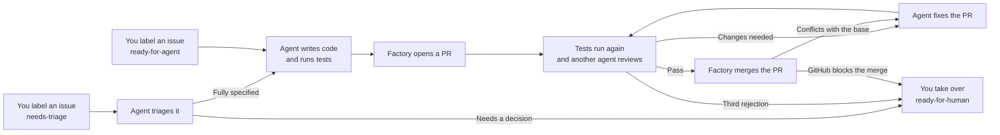

# software-factory

Turn GitHub issues into tested, reviewed code using coding agents in GitHub Actions.

You describe the work in an issue and add `ready-for-agent`, or add `needs-triage` to have an agent check the issue and write the brief first. The factory writes the code, runs your tests, opens a pull request, and uses another agent to review it and request fixes.

**When tests and review pass, the factory squash-merges the PR automatically, if GitHub allows it.** If the PR conflicts with its base branch, the fixer merges the base in and resolves the conflicts. After three rounds of changes, or if GitHub blocks the merge for another reason, it hands the PR to you.

The default agent is pi, using OpenRouter. Claude Code is also supported. Each stage runs on a fresh GitHub Actions runner. You supply the issue, test command, and model credentials.

See the [example repository](https://github.com/jonbaldie/software-factory-sandbox).

## How it works



## Install in your repository

You need:

- A local clone of the GitHub repository you want to automate, with admin access.
- The [GitHub CLI](https://cli.github.com), signed in with `gh auth login`.
- A test command that can run without interaction on an Ubuntu runner.
- An OpenRouter API key, or [Claude Code credentials](#choose-an-agent).

### 1. Run the installer

From your repository's directory:

```sh
curl -fsSL https://raw.githubusercontent.com/jonbaldie/software-factory/v1/install.sh | bash
```

The installer detects `npm test` when `package.json` has a test script, and `npm ci` when a `package-lock.json` exists. For other projects, provide your commands:

```sh
curl -fsSL https://raw.githubusercontent.com/jonbaldie/software-factory/v1/install.sh \
  | bash -s -- --test-command 'make test' --setup-command 'make deps'
```

It copies workflows and prompts into `.github/`, creates labels, sets the test and setup commands, and tries to enable Actions to create and approve PRs. It preserves existing `bug` and `enhancement` labels.

### 2. Add the model key

For the default agent, run this and paste your OpenRouter key when prompted:

```sh
gh secret set OPENROUTER_API_KEY
```

Use a key with its own spending limit. To use Claude Code, follow [Choose an agent](#choose-an-agent) instead.

If the installer reports a permissions problem, enable **Settings → Actions → General → Allow GitHub Actions to create and approve pull requests**. Your organisation may need to allow this first.

### 3. Commit and merge the installed files

Review the changes under `.github/`, commit them, and get them onto your default branch. If the branch is protected, use a pull request. Complete this before starting an issue.

## Run your first issue

1. Open an issue that describes the expected behaviour and how to check it. For a bug, include reproduction steps and the actual result.
2. Add `needs-triage` to have an agent [triage it](#triage-issues). Or read it yourself, add `bug` or `enhancement` if either applies, then add `ready-for-agent` to start the factory.
3. Follow the run link posted on the issue, or open the repository's **Actions** tab.

Agents work without asking follow-up questions. Put requirements and constraints in the issue or in comments from repository owners, members, or collaborators. The agents record their decisions in the PR description.

| Issue label | What the agent does |
|---|---|
| `bug` | Reproduces the reported problem, investigates the cause, and adds a regression test before fixing it. If a test cannot reach the bug, the PR must explain why. |
| `enhancement` | Builds one behaviour at a time: writes a failing test through a public interface, then implements enough code to pass it. |
| Neither | Follows the general implementation instructions and runs your tests. |

If both labels are present, `bug` takes precedence. If the agent cannot reproduce a reported bug, it stops and posts what it tried and what information it needs.

## Triage issues

Add `needs-triage` to an issue to have an agent triage it. The triager reads the issue, its comments, your code and the titles of the other open issues. It posts a comment, and sets one category, `bug` or `enhancement`, and one state:

| State | Triage comment | Next |
|---|---|---|
| `ready-for-agent` | A brief for the implementer: summary, current and desired behaviour, interfaces to change, acceptance criteria, and what is out of scope. | Implementation starts. |
| `ready-for-human` | The same brief, plus the decision you need to make. | You decide, then add `ready-for-agent` or build it yourself. |
| `needs-info` | What is settled, and questions for the reporter. | Re-add `needs-triage` once they answer. |
| `wontfix` | Where it is already built, or the open issue that covers it. | The issue is closed. |

**A `ready-for-agent` triage starts implementation straight away, so an issue can go from triage to a merged PR with no human reading it.** Only people with triage access or above can add labels, so outside reporters cannot start triage themselves. The factory ships no issue template for this reason: a template that adds `needs-triage` would let anyone who opens an issue start the chain.

The triager also reads comments from the issue's author, so it sees their answers to its questions. Implementation, review and fix read only comments from repository owners, members and collaborators, plus triage's own comments. A repeat triage replaces the earlier category and state labels.

## Configuration

Set repository variables under **Settings → Secrets and variables → Actions → Variables**.

| Variable | Purpose | Default |
|---|---|---|
| `FACTORY_TEST_COMMAND` | Command that must pass before a PR opens or merges. | Required; installer detects `npm test` where available. |
| `FACTORY_SETUP_COMMAND` | Installs dependencies before each agent stage. | None; installer detects `npm ci` when `package-lock.json` exists. |
| `FACTORY_HARNESS` | Chooses the agent: `pi` or `claude`. | `pi` |
| `FACTORY_MODEL` | Chooses the model for all agent stages. | See below. |

The workflows install Node 22 for the agent. Add setup steps to the workflows if your project needs other runtimes or services.

### Choose an agent

| Agent | `FACTORY_HARNESS` | Default `FACTORY_MODEL` | Repository secret |
|---|---|---|---|
| pi via OpenRouter | `pi` | `openrouter/openai/gpt-6-luna:max` | `OPENROUTER_API_KEY` |
| Claude Code | `claude` | `sonnet` | `ANTHROPIC_API_KEY` or `CLAUDE_CODE_OAUTH_TOKEN` |

For example, to use Claude Code with an Anthropic API key:

```sh
gh variable set FACTORY_HARNESS --body claude
gh secret set ANTHROPIC_API_KEY
```

For the token option, generate a token with `claude setup-token` and save it as `CLAUDE_CODE_OAUTH_TOKEN`. If you previously set `FACTORY_MODEL`, update it for the new agent or delete it to use the default.

To choose a different model for one stage, set `model` on that workflow's `run-agent` step.

### Set project instructions

Put coding standards in your repository's `AGENTS.md` or `CLAUDE.md`. The implementer is told to follow them and the reviewer is told to check them.

Edit the prompts in `.github/factory/` to change how the agents work. Review and fix read the prompts from the PR's base branch, so your edits also apply to PRs that are already open. The [bug](template/.github/factory/bug.md) and [enhancement](template/.github/factory/enhancement.md) prompts contain the full methods and review checklists.

## Check progress and recover from failures

Issue and PR comments link to the relevant workflow runs. Agent runs provide live logs, a summary with model usage and cost, and a downloadable transcript.

| Label | Meaning or next step |
|---|---|
| `needs-triage` | The agent is triaging the issue. Add it to request a triage. |
| `agent:working` | The agent is implementing the issue. |
| `agent:review` | The PR is queued for review or being reviewed. Add it to request another review. |
| `agent:changes-requested` | The PR needs fixes. You can add it with a comment explaining what to change. |
| `agent:approved` | The agent approved the PR. Check whether it merged; GitHub may still block it. |
| `agent:failed` | A stage failed, timed out, or was cancelled. Read the linked run, fix the cause, then retry as described below. |
| `agent:wip` | Implementation failed after the agent changed files. The unfinished work and the reason it stopped are saved on the `agent/issue-N` branch. |
| `ready-for-human` | You need to take over. On an issue, triage's comment names the decision. On a PR, three reviews were rejected or GitHub blocked the merge; check the review comments and GitHub's merge status. |

To retry a failed triage, re-add `needs-triage`. To retry implementation, remove and re-add `ready-for-agent` on the issue. If the issue has `agent:wip`, the retry continues from the saved work; remove `agent:wip` first to start over. To retry a failed review or fix, re-add `agent:review` or `agent:changes-requested` on the PR. Adding a label that is already present starts nothing.

## Costs and limits

Each agent run has a model spending threshold:

| Stage | Budget per run |
|---|---|
| Triage | $0.50 |
| Implement | $1.50 |
| Review | $0.75 |
| Fix | $1.00 |

These are per-run budgets, not a total limit for an issue. pi is stopped after its reported cost exceeds the threshold; Claude Code receives a budget flag. Set a spending limit on the model key too. GitHub Actions usage is separate.

The factory also applies these limits:

- At most two automatic fix rounds, counting merge conflicts; a third rejected review hands the PR to you.
- The triager and reviewer are configured with read and search tools only. An invalid triage or review response fails the stage.
- Implementation and fix stages reject edits under `.github/`.
- Workflow steps handle commits and pushes. Checkouts for the agents do not retain GitHub credentials.
- Issue comments and human feedback included in prompts are limited to repository owners, members, collaborators, and the factory's triage comments. Triage also reads the issue author's comments, and the titles of all open issues, whoever opened them, to spot duplicates.
- Runs are serialised per issue or PR.

The factory attempts to merge approved PRs with the built-in GitHub token. A merge conflict goes back to the fixer, which merges the base branch in and resolves it. Branch rules still apply: if required approvals or other checks block a merge, you must resolve them.

## Daily TODO scan

The scout workflow runs daily and creates `needs-triage` issues from code comments such as:

```js
// TODO(factory): Add pagination to the search results
```

It skips Markdown and `.github/`, checks existing issue titles to avoid duplicates, and writes a queue report in the run summary. The scout itself uses no model, but it starts a [triage](#triage-issues) run for each issue it creates. A TODO that triage marks `ready-for-agent` is then built and can merge with no human step.

## Update the factory

Rerun the installer, review `git diff`, and commit the changes. It overwrites the installed workflows and prompts, so restore any custom edits you want to keep.

The workflows use `jonbaldie/software-factory/run-agent@v1`. Changes to that version arrive without reinstalling. To pin the runner, replace `@v1` with a specific release tag or commit in each workflow.

## Licence

[MIT](LICENSE)

Inspired by [Matt Pocock](https://x.com/mattpocockuk)'s approach to software factories.
