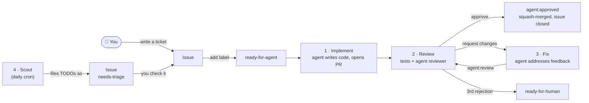

# software-factory

A software factory made of GitHub Actions, after [this post by Matt Pocock](https://x.com/mattpocockuk). Issues are tickets, labels move work between stages, and a coding agent does the work on throwaway Actions runners. You label an issue; the factory opens a pull request, reviews it, fixes it and merges it.

The agent is [pi](https://github.com/earendil-works/pi) running `openai/gpt-6-luna` at `max` thinking through OpenRouter. Claude Code works too: see [Choosing the agent](#choosing-the-agent).

[software-factory-sandbox](https://github.com/jonbaldie/software-factory-sandbox) is a working example.



## Install

You need the [GitHub CLI](https://cli.github.com), logged in, and admin access to the repo. From a clone of your repo:

```sh
curl -fsSL https://raw.githubusercontent.com/jonbaldie/software-factory/v1/install.sh | bash
```

The installer:

- copies the workflows into `.github/workflows/factory-*.yml` and the agent prompts into `.github/factory/`
- creates the [labels](#labels)
- allows GitHub Actions to create and approve pull requests
- sets the `FACTORY_TEST_COMMAND` and `FACTORY_SETUP_COMMAND` [variables](#configuration)
- checks the agent's API key secret is set, and tells you how to add it if it isn't

Then add the API key if asked, and commit `.github`. Push it to the default branch, or merge it in a pull request if the branch is protected: the workflows only run from the default branch. Give the factory a fully specified issue, add `ready-for-agent`, and watch the Actions tab.

Pass options after `bash -s --`:

```sh
curl -fsSL https://raw.githubusercontent.com/jonbaldie/software-factory/v1/install.sh | bash -s -- --test-command 'make test' --setup-command 'make deps'
```

Run the installer with `--help` for the full list. It's safe to rerun.

## Configuration

The factory reads these repository variables (Settings → Secrets and variables → Actions → Variables):

| Variable | Meaning | Default |
|---|---|---|
| `FACTORY_TEST_COMMAND` | Runs your tests. The agents are told to make it pass, the PR is only opened if it does, and the reviewer sees its output. | Required. The installer sets `npm test` when `package.json` has a test script. |
| `FACTORY_SETUP_COMMAND` | Runs before the agent and the tests, such as `npm ci` or `pip install -e '.[test]'`. | None. The installer sets `npm ci` when `package-lock.json` exists. |
| `FACTORY_HARNESS` | `pi` or `claude`. | `pi` |
| `FACTORY_MODEL` | The model for every stage. | `openrouter/openai/gpt-6-luna:max` for pi, `sonnet` for claude |

The runner has Node 22, which the agent needs. Ubuntu runners also come with Python, Go and Rust. For anything else, add a setup step to the workflows.

The prompts in `.github/factory/` are yours to tune. Write your coding standards in `AGENTS.md` (or `CLAUDE.md`): the implementer follows them and the reviewer enforces them.

## How it maps to the post

| The post says | Where it is |
|---|---|
| 1. Free sandboxes for public repos | Every agent runs on a fresh `ubuntu-latest` runner with no permission prompts. The runner is the sandbox, and it's thrown away afterwards. |
| 2. You already have a login | Permissions are GitHub's own: only people with triage access can add labels, so only they can start the factory. |
| 3. Tickets as issues | The implementer's prompt is [`implement.md`](template/.github/factory/implement.md) plus the issue title and body. |
| 4. Labels trigger actions, which create PRs | Adding `ready-for-agent` runs [`factory-implement.yml`](template/.github/workflows/factory-implement.yml), which opens a PR. |
| 5. Actions apply labels, which create loops | Review → fix → review, in [`factory-review.yml`](template/.github/workflows/factory-review.yml) and [`factory-fix.yml`](template/.github/workflows/factory-fix.yml). There's a round limit so it can't loop forever. |
| 6. Cron jobs for daily work | [`factory-scout.yml`](template/.github/workflows/factory-scout.yml) files `TODO(factory):` comments as tickets and posts a queue report. |
| 7. Simple observability | Each agent run streams a readable log, writes its model, turns and cost to the job summary, and uploads its full transcript as an artifact. Each issue and PR gets a comment linking to its run. |

## Labels

The first five are the default triage labels used by [Matt Pocock's skills](https://github.com/mattpocock/skills), such as `/triage`. The `agent:*` labels show where a ticket is in the factory.

| Label | On | Meaning | Set by |
|---|---|---|---|
| `needs-triage` | issue | Someone needs to check this ticket. | scout, or anyone filing an issue |
| `needs-info` | issue | Waiting on the reporter for more information. | you, or `/triage` |
| `ready-for-agent` | issue | Go. Starts **1 · Implement**. | you, or `/triage` |
| `ready-for-human` | issue or PR | A human has to do this one. The factory adds it to a PR after the reviewer's third rejection. | you, `/triage`, or the factory |
| `wontfix` | issue | Won't be done. | you, or `/triage` |
| `agent:working` | issue | The implementer is on it. | factory |
| `agent:review` | PR | Starts **2 · Review**. | factory, or you to re-review |
| `agent:changes-requested` | PR | Starts **3 · Fix**. | factory, or you, with a comment saying what to change |
| `agent:approved` | PR | The reviewer approved and the factory merged it. | factory |
| `agent:failed` | either | A stage crashed. The comment links to the run. | factory |

## The catch: `GITHUB_TOKEN` doesn't trigger workflows

Events caused by the built-in `GITHUB_TOKEN` [don't start new workflow runs](https://docs.github.com/en/actions/security-for-github-actions/security-guides/automatic-token-authentication#using-the-github_token-in-a-workflow), apart from `workflow_dispatch` and `repository_dispatch`. This stops accidental infinite loops, but it also means a label the factory adds won't trigger the next stage.

So the labels are the **state**, and each stage also runs `gh workflow run <next-stage>.yml` to start the next one. A label added by a human still triggers its stage, because that event comes from a real user.

If you'd rather have labels alone drive everything, use a GitHub App token or a fine-grained PAT instead of `GITHUB_TOKEN`. Events caused by those do trigger workflows.

## Guardrails

- **Cost**: each agent run has a cap: $1.50 to implement, $0.75 to review, $1.00 to fix. pi has no budget flag, so [`pi.mjs`](run-agent/pi.mjs) watches the cost pi reports and stops it once a run goes over. Claude Code enforces the cap itself with `--max-budget-usd`.
- **A spend limit on the key**: the per-run cap is counted on the runner. Give the API key its own credit limit too, so the provider refuses requests once the limit is reached, whatever happens on the runner.
- **Loops**: the reviewer can send a PR back twice. The third rejection hands it to a human.
- **Credentials**: the checkout uses `persist-credentials: false`, and `GH_TOKEN` is only set on the steps that need it. The agent gets the model key and nothing else. The workflow, not the agent, commits and pushes.
- **The factory owns `.github`**: a stage fails if the agent changed anything under `.github/`, so an agent can't rewrite its own workflows or prompts.
- **The reviewer is read-only**: its only tools are read, glob and grep. pi has no permission system, so this allowlist is the only thing stopping it from writing.
- **The reviewer must answer properly**: its verdict has to match a JSON schema. Claude Code enforces this with `--json-schema`. pi has no equivalent, so `pi.mjs` asks for a JSON block and checks it. A missing or malformed verdict fails the stage instead of being guessed.
- **No project-local agent config**: pi runs with `--no-approve`, so a PR can't add `.pi/extensions` that run inside the agent.
- **Script injection**: issue text reaches the agent through files and environment variables, never through `${{ }}` in shell scripts.
- **Concurrency**: one run per issue or PR at a time.
- **Prompt injection**: anyone can open an issue on a public repo, but only people with triage access can add `ready-for-agent`. Read a ticket before you label it.
- **Branch protection**: the reviewer merges with `GITHUB_TOKEN`. If your default branch requires a human approval, approved PRs wait for one.

## Choosing the agent

The workflows run every agent through [`run-agent`](run-agent/action.yml), a composite action in this repo, as `jonbaldie/software-factory/run-agent@v1`. It runs either harness:

| `FACTORY_HARNESS` | Default `FACTORY_MODEL` | Secret |
|---|---|---|
| `pi` (default) | `openrouter/openai/gpt-6-luna:max` | `OPENROUTER_API_KEY` |
| `claude` | `sonnet` | `CLAUDE_CODE_OAUTH_TOKEN` from `claude setup-token`, or `ANTHROPIC_API_KEY` |

pi takes any model it lists with `pi --list-models`, written as `provider/id:thinking`. To use a different model for one stage, for example a stronger reviewer, set `model` on that stage's `run-agent` step.

For pi, create an OpenRouter key just for this repo. Give it a credit limit and, if you like, a guardrail that allows only the model you use.

Use an API key or a Claude token, not a ChatGPT or Codex subscription login. OpenAI's [CI auth guide](https://developers.openai.com/codex/auth/ci-cd-auth) rules a subscription login out on public repos, and it would sit in a file the agent can read.

## Upgrading

Rerun the installer, then check `git diff` before you commit. It overwrites the workflows and prompts, so re-apply any edits you want to keep.

`run-agent@v1` follows the latest `v1.x` release, so fixes to the agent runner arrive without reinstalling. To pin one, change `@v1` to a tag such as `@v1.0.0` in the workflows.

## Licence

[MIT](LICENSE)
